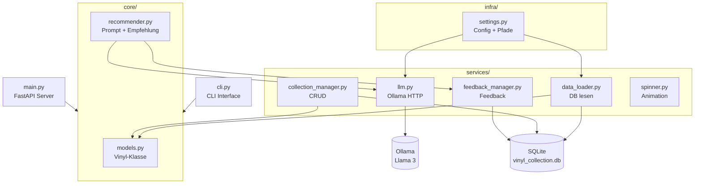

# Vinyl Recommendations

Empfiehlt Schallplatten aus einer persönlichen Sammlung basierend auf Stimmung, Anlass und verfügbarer Hörzeit. Powered by Ollama (Llama 3).

Das System lernt durch Nutzerfeedback und verbessert seine Empfehlungen über die Zeit. Bei negativer Stimmung werden automatisch zwei Varianten angeboten: Musik die die Stimmung spiegelt, und Musik die aufheitert.

---

## Tech Stack

| Komponente | Technologie |
|------------|-------------|
| Backend | Python 3.13 |
| Datenbank | SQLite |
| LLM | Ollama / Llama 3 (8B, lokal) |
| API | FastAPI + Uvicorn |
| Frontend | HTML / CSS / JS (in Entwicklung) |
| Versionierung | Git / GitHub |
| Daten | Externe SSD (T7_ML) |

---

## Setup

### Voraussetzungen

- Python 3.11+
- [Ollama](https://ollama.com) installiert
- Llama 3 Modell gepullt: `ollama pull llama3`

### Installation
```bash
# Repository klonen
git clone https://github.com/NoahRolli/vinylRec.git
cd vinylrecommendations

# Virtuelle Umgebung erstellen und aktivieren
python3 -m venv .venv
source .venv/bin/activate

# Abhängigkeiten installieren
pip install -r requirements.txt

# .env Datei erstellen (siehe .env.example)
cp .env.example .env

# Datenbank erstellen
python -m services.db_setup
```

### Starten
```bash
# CLI starten
python cli.py

# API starten
uvicorn main:app --reload
# API Docs: http://localhost:8000/docs
```

---

## Features

- **Schallplattenempfehlung** — Beschreibe Stimmung, Anlass und Hörzeit, das LLM empfiehlt passende Platten aus deiner Sammlung
- **Stimmungscheck** — Bei negativer Stimmung werden zwei Optionen angeboten: Stimmung spiegeln oder heben
- **Feedback-System** — Bewerte Empfehlungen, das System lernt für zukünftige Vorschläge
- **Sammlungsverwaltung** — Platten hinzufügen, bearbeiten und löschen (CRUD)
- **Ladeanimation** — Spinner zeigt an, dass Ollama arbeitet
- **REST API** — FastAPI-Endpunkte für zukünftiges Web-Frontend

---

## Projektstruktur
```
vinylrecommendations/
├── core/                    # Geschäftslogik
│   ├── models.py            # Vinyl-Datenmodell
│   └── recommender.py       # Prompt Engineering + Empfehlungslogik
├── services/                # Externe Anbindungen
│   ├── cli.py               # Menüführung + Nutzereingaben
│   ├── collection_manager.py # CRUD-Operationen
│   ├── data_loader.py       # SQLite → Vinyl-Objekte
│   ├── db_setup.py          # Datenbank erstellen
│   ├── feedback_manager.py  # Feedback speichern + laden
│   ├── llm.py               # Ollama HTTP-Kommunikation
│   └── spinner.py           # Ladeanimation
├── infra/                   # Konfiguration
│   └── settings.py          # Pfade, Ollama-Config
├── frontend/                # Web-Interface (in Entwicklung)
│   ├── css/style.css
│   ├── js/app.js
│   └── index.html
├── test/                    # Tests
├── main.py                  # FastAPI Server
├── cli.py                   # CLI Einstiegspunkt
├── .env.example             # Umgebungsvariablen Vorlage
├── requirements.txt         # Python-Abhängigkeiten
└── README.md
```

---

## Architektur


---

## API Endpunkte

| Methode | Endpunkt | Beschreibung |
|---------|----------|--------------|
| GET | `/api/collection` | Gesamte Sammlung abrufen |
| POST | `/api/collection` | Neue Platte hinzufügen |
| DELETE | `/api/collection/{id}` | Platte löschen |
| POST | `/api/recommend` | Empfehlung generieren |
| POST | `/api/feedback` | Feedback speichern |
| GET | `/api/feedback` | Feedbacks abrufen |

---

## Nützliche Befehle

| Was | Befehl |
|-----|--------|
| CLI starten | `python cli.py` |
| API starten | `uvicorn main:app --reload` |
| venv aktivieren | `source .venv/bin/activate` |
| DB neu erstellen | `python -m services.db_setup` |
| DB prüfen | `sqlite3 data/vinyl_collection.db "SELECT * FROM vinyl;"` |
| Ollama starten | `ollama serve` |
| Modell pullen | `ollama pull llama3` |
| Dependencies | `pip install -r requirements.txt` |

---

## Roadmap

- [x] CLI mit Menüführung
- [x] SQLite Datenbank
- [x] Ollama Integration
- [x] Sammlungsverwaltung (CRUD)
- [x] Feedback-System
- [x] Stimmungscheck
- [x] FastAPI Endpunkte
- [ ] Kaufempfehlungen (Discogs API)
- [ ] Web-Frontend (HTML/CSS/JS)
- [ ] Unit Tests
- [ ] Web-Interface (React Migration)

---

## Lizenz

Privates Projekt.