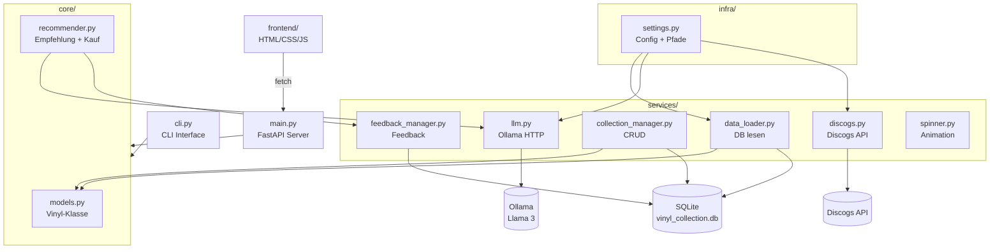

# Vinyl Recommendations

Empfiehlt Schallplatten aus einer persönlichen Sammlung basierend auf Stimmung, Anlass und verfügbarer Hörzeit. Powered by Ollama (Llama 3).

Das System lernt durch Nutzerfeedback und verbessert seine Empfehlungen über die Zeit. Bei negativer Stimmung werden automatisch zwei Varianten angeboten: Musik die die Stimmung spiegelt, und Musik die aufheitert.

---

## Tech Stack

| Komponente | Technologie |
|------------|-------------|
| Backend | Python 3.13 |
| Datenbank | SQLite |
| LLM | Ollama / Llama 3 (8B, lokal) |
| API | FastAPI + Uvicorn |
| Frontend | HTML / CSS / JS (modular aufgeteilt) |
| Externe API | Discogs (Kaufempfehlungen) |
| CI/CD | GitHub Actions (ruff + pytest) |
| Dokumentation | MkDocs + GitHub Pages |
| Versionierung | Git / GitHub |

---

## Setup

### Voraussetzungen

- Python 3.11+
- [Ollama](https://ollama.com) installiert
- Llama 3 Modell gepullt: `ollama pull llama3`
- [Discogs](https://www.discogs.com/settings/developers) API-Token (für Kaufempfehlungen)

### Installation
```bash
# Repository klonen
git clone https://github.com/NoahRolli/vinylRec.git
cd vinylrecommendations

# Virtuelle Umgebung erstellen und aktivieren
python3 -m venv .venv
source .venv/bin/activate

# Abhängigkeiten installieren
pip install -r requirements.txt

# .env Datei erstellen und anpassen
cp .env.example .env

# Datenbank erstellen
python -m services.db_setup
```

### Starten
```bash
# Option 1: CLI
python cli.py

# Option 2: API + Frontend (zwei Terminals)
# Terminal 1:
uvicorn main:app --reload
# Terminal 2:
open frontend/index.html

# API Docs: http://localhost:8000/docs
```

---

## Features

- **Schallplattenempfehlung** — Beschreibe Stimmung, Anlass und Hörzeit, das LLM empfiehlt passende Platten aus deiner Sammlung
- **Stimmungscheck** — Bei negativer Stimmung werden zwei Optionen angeboten: Stimmung spiegeln oder heben
- **Feedback-System** — Bewerte Empfehlungen direkt im Frontend oder CLI, das System lernt für zukünftige Vorschläge
- **Sammlungsverwaltung** — Platten hinzufügen, filtern und löschen (im Frontend und CLI)
- **Kaufempfehlungen** — LLM analysiert Lücken in der Sammlung mit drei Strategien: Lücken füllen, Ergänzen, Neues entdecken
- **Discogs-Suche** — Direkte Suche auf Discogs mit Genre-Filter
- **Ladeanimation** — Fortschrittsbalken mit Statustext und Abbrechen-Button
- **REST API** — FastAPI-Endpunkte mit interaktiver Dokumentation unter /docs
- **CI/CD** — Automatisches Linting (ruff) und Tests (pytest) bei jedem Push

---

## Projektstruktur
```
vinylrecommendations/
├── core/                        # Geschäftslogik
│   ├── models.py                # Vinyl-Datenmodell
│   └── recommender.py           # Empfehlungs- und Kauflogik
├── services/                    # Externe Anbindungen
│   ├── cli.py                   # Menüführung + Nutzereingaben
│   ├── collection_manager.py    # CRUD-Operationen
│   ├── data_loader.py           # SQLite → Vinyl-Objekte
│   ├── db_setup.py              # Datenbank erstellen
│   ├── discogs.py               # Discogs-API Anbindung
│   ├── feedback_manager.py      # Feedback speichern + laden
│   ├── llm.py                   # Ollama HTTP-Kommunikation
│   └── spinner.py               # CLI-Ladeanimation
├── infra/                       # Konfiguration
│   └── settings.py              # Pfade, Ollama-Config, Tokens
├── frontend/                    # Web-Interface (modular)
│   ├── css/
│   │   ├── base.css             # Reset, Body, Grundstile
│   │   ├── navigation.css       # Tab-Navigation
│   │   ├── forms.css            # Inputs, Buttons, Feedback
│   │   ├── collection.css       # Tabelle, Lösch-Buttons
│   │   ├── loading.css          # Progress Bar, Spinner, Abbrechen
│   │   └── discogs.css          # Discogs-Ergebniskarten
│   ├── js/
│   │   ├── config.js            # API-URL, globale Variablen
│   │   ├── helpers.js           # Statusanimation, Hilfsfunktionen
│   │   ├── navigation.js        # Tab-Wechsel
│   │   ├── recommend.js         # Empfehlung + Feedback
│   │   ├── collection.js        # Sammlung laden, filtern, CRUD
│   │   └── purchase.js          # Kaufempfehlung + Discogs
│   └── index.html               # Einstiegsseite
├── test/                        # Tests
│   └── test_placeholder.py      # Platzhalter für CI
├── docs/                        # MkDocs Dokumentation
│   ├── index.md                 # Startseite
│   ├── architecture.md          # Architektur + DB-Schema
│   ├── api.md                   # API-Referenz
│   ├── setup.md                 # Setup Guide
│   └── changelog.md             # Versionshistorie
├── .github/workflows/
│   ├── ci.yml                   # Linting + Tests
│   └── docs.yml                 # MkDocs → GitHub Pages
├── main.py                      # FastAPI Server
├── cli.py                       # CLI Einstiegspunkt
├── mkdocs.yml                   # MkDocs Konfiguration
├── .env.example                 # Umgebungsvariablen Vorlage
├── requirements.txt             # Python-Abhängigkeiten
└── README.md
```

---

## Architektur

```mermaid
graph TD
    CLI[cli.py<br/>CLI Interface] --> CORE
    API[main.py<br/>FastAPI Server] --> CORE
    WEB[frontend/<br/>HTML/CSS/JS] -->|fetch| API

    subgraph CORE[core/]
        MODELS[models.py<br/>Vinyl-Klasse]
        REC[recommender.py<br/>Empfehlung + Kauf]
    end

    subgraph SERVICES[services/]
        LLM[llm.py<br/>Ollama HTTP]
        DL[data_loader.py<br/>DB lesen]
        CM[collection_manager.py<br/>CRUD]
        FM[feedback_manager.py<br/>Feedback]
        DC[discogs.py<br/>Discogs API]
        SPIN[spinner.py<br/>Animation]
    end

    subgraph INFRA[infra/]
        SETTINGS[settings.py<br/>Config + Pfade]
    end

    REC --> LLM
    REC --> FM
    DL --> MODELS
    CM --> MODELS

    LLM --> OLLAMA[(Ollama<br/>Llama 3)]
    DC --> DISCOGS[(Discogs API)]
    DL --> DB[(SQLite<br/>vinyl_collection.db)]
    CM --> DB
    FM --> DB
    SETTINGS --> DL
    SETTINGS --> LLM
    SETTINGS --> DC
```

---

## API Endpunkte

| Methode | Endpunkt | Beschreibung |
|---------|----------|--------------|
| GET | `/api/collection` | Gesamte Sammlung abrufen |
| POST | `/api/collection` | Neue Platte hinzufügen |
| DELETE | `/api/collection/{id}` | Platte löschen |
| POST | `/api/recommend` | Hörempfehlung generieren |
| POST | `/api/purchase` | Kaufempfehlung generieren |
| GET | `/api/discogs/search` | Discogs-Suche mit Genre-Filter |
| POST | `/api/feedback` | Feedback speichern |
| GET | `/api/feedback` | Feedbacks abrufen |

---

## Nützliche Befehle

| Was | Befehl |
|-----|--------|
| CLI starten | `python cli.py` |
| API starten | `uvicorn main:app --reload` |
| Frontend öffnen | `open frontend/index.html` |
| venv aktivieren | `source .venv/bin/activate` |
| DB neu erstellen | `python -m services.db_setup` |
| DB prüfen | `sqlite3 data/vinyl_collection.db "SELECT * FROM vinyl;"` |
| Ollama starten | `ollama serve` |
| Linting lokal | `ruff check .` |
| Tests lokal | `pytest test/ -v` |
| Dependencies | `pip install -r requirements.txt` |

---

## Roadmap

- [x] CLI mit Menüführung
- [x] SQLite Datenbank
- [x] Ollama Integration
- [x] Sammlungsverwaltung (CRUD)
- [x] Feedback-System
- [x] Stimmungscheck
- [x] FastAPI Endpunkte
- [x] Kaufempfehlungen (Discogs API)
- [x] Web-Frontend (HTML/CSS/JS modular)
- [x] Fortschrittsanzeige + Abbrechen
- [x] GitHub Actions CI (ruff + pytest)
- [x] MkDocs Dokumentation
- [ ] Unit Tests (models, recommender, API)
- [ ] React Migration (optional)

---

## Lizenz

Privates Projekt - Noah Rolli