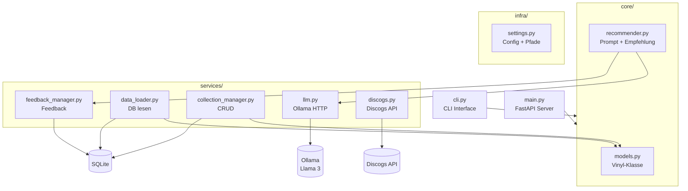

# Architektur

## Schichtenmodell

Das Projekt folgt einer strikten Separation of Concerns:

| Schicht | Aufgabe | Beispiel |
|---------|---------|----------|
| `core/` | Was das Programm **ist** | Vinyl-Modell, Empfehlungslogik |
| `services/` | Was das Programm **benutzt** | DB, Ollama, Discogs, CLI |
| `infra/` | Was das Programm **konfiguriert** | Pfade, Modellwahl, Tokens |
| `main.py` | Was das Programm **startet** | FastAPI Server |
| `cli.py` | Alternative Oberfläche | Terminal-Menü |

## Abhängigkeiten

## Datenbankstruktur

### Tabelle: vinyl

| Spalte | Typ | Beschreibung |
|--------|-----|-------------|
| id | INTEGER PK | Eindeutige ID (auto) |
| artist | TEXT NOT NULL | Künstlername |
| album | TEXT NOT NULL | Albumtitel |
| genre_primary | TEXT | Hauptgenre |
| genre_secondary | TEXT | Nebengenre |
| mood | TEXT | Stimmung |
| year | INTEGER | Erscheinungsjahr |
| type | TEXT | studio / compilation / live |

### Tabelle: feedback

| Spalte | Typ | Beschreibung |
|--------|-----|-------------|
| id | INTEGER PK | Eindeutige ID (auto) |
| vinyl_id | INTEGER FK | Referenz auf vinyl.id |
| mood | TEXT | Stimmung bei Empfehlung |
| occasion | TEXT | Anlass bei Empfehlung |
| rating | TEXT | gut / mittel / schlecht |
| comment | TEXT | Freitext-Kommentar |
| created_at | TIMESTAMP | Automatisch gesetzt |